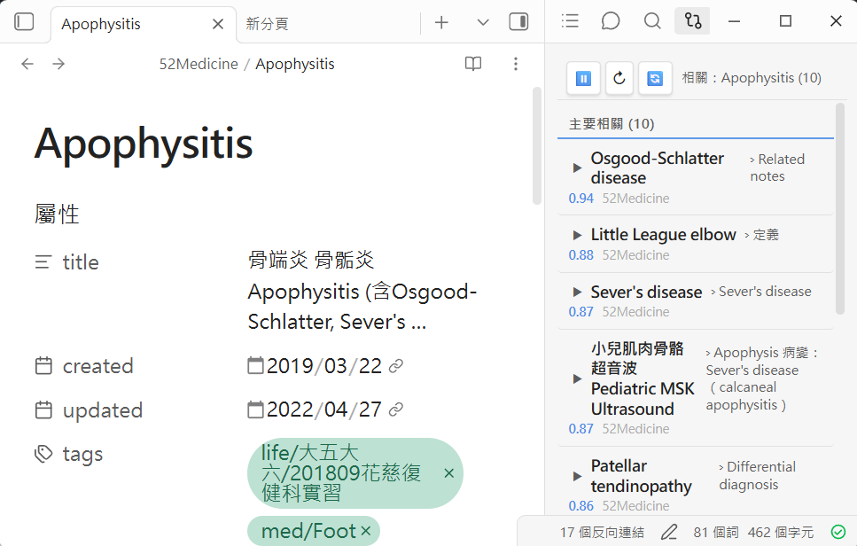

# Obsidian Vault Search — a local-first semantic search trio

> **English** · [繁體中文](./README.zh-TW.md)

Three tools that turn your Obsidian vault into a **semantically searchable, AI-chattable knowledge base** — running entirely on your own machine. No cloud indexing, no notes leaving your computer for search, no per-query API bill for retrieval.

Built by a physician to study from a vault of thousands of clinical notes, but **domain-agnostic**: point it at any vault of markdown notes (research, law, engineering, a personal wiki) and it works.



---

## The three-piece set (三套組)

| Tool | What it does | Backed by |
|---|---|---|
| 🔍 **Vault Search** | Type a question in natural language (any language) and get the most *semantically* relevant note sections — not keyword matches. | LanceDB vector search + local embeddings |
| 🔗 **Related Notes** | A live sidebar that, as you read or select text, surfaces related notes you forgot you wrote — surfacing hidden links across your vault. | Same index, "find similar" mode |
| 💬 **Vault Chat** | Chat with your notes (RAG). Three modes: **Vault** (notes only, 100% local & free), **Hybrid** (notes + AI knowledge), **Free** (open chat + literature search). | Local LLM *or* your Claude subscription |

All three live in the Obsidian sidebar. The same index also exposes an **MCP server**, so coding agents like Claude Code can search your vault as a tool.

---

## Why it exists

Built-in Obsidian search is lexical — it finds the words you typed. But you rarely remember the exact words in a note you wrote months ago. Semantic search finds notes by *meaning*: search `"how to manage a flaccid bladder after spinal injury"` and it finds your note titled `Neurogenic Bladder` even if those exact words never appear.

The design priority is **local-first and private**:

- **Embeddings run locally** via [Ollama](https://ollama.com) (`bge-m3`, bilingual, CPU-friendly). Your note text is never sent anywhere to be indexed or searched.
- **Vault-mode chat is fully local and free** — a local LLM answers using retrieved notes, zero tokens billed.
- **Hybrid/Free chat optionally** shells out to the `claude` CLI so you can use a Claude subscription you already pay for, instead of wiring up (and paying per-token for) a raw API key.

---

## How it works

```
                    ┌─────────────────────────────────────────┐
   Obsidian  ◄────► │  Plugin (sidebar): Search · Related · Chat│
                    └───────────────────┬─────────────────────┘
                                        │ HTTP (localhost:3789)
                                        ▼
                    ┌─────────────────────────────────────────┐
                    │  api_server.py  (FastAPI)                 │
                    │   /search  /similar  /chat  /reindex      │
                    └──────┬───────────────────────┬───────────┘
                           │                        │
                  embed query                 RAG context
                           ▼                        ▼
        ┌────────────────────────┐     ┌──────────────────────────┐
        │ Ollama  (bge-m3)        │     │ Vault mode → local LLM    │
        │ → vector               │     │ Hybrid/Free → `claude` CLI │
        └───────────┬────────────┘     └──────────────────────────┘
                    ▼
        ┌────────────────────────┐
        │ LanceDB vector index   │  ◄── indexer.py  (chunks notes by heading,
        │ (~/.vault-search)      │       embeds, stores; incremental updates)
        └────────────────────────┘

   Same index + scoring is also served to coding agents via mcp_server.py (MCP).
```

- **`indexer.py`** walks your vault, splits each note into chunks by heading, embeds them with `bge-m3`, and stores them in a local **LanceDB** table. Re-runs are incremental (content-hash cache).
- **`scoring.py`** reranks raw vector hits with optional **path weighting** (trust some folders more), **recency** (newer notes rank higher), and **relation** boosts.
- **`api_server.py`** serves the plugin: semantic search, find-similar, single-note reindex, and chat (with retrieval-augmented context).
- **`mcp_server.py`** exposes the same search to MCP clients (e.g. Claude Code) as `vault_search`, `vault_similar`, `vault_stats`.
- **Optional add-ons:** a second long-form **reference corpus** (`textbook_indexer.py`, parent-child chunking) and a **knowledge graph** of `[[wikilinks]]` + entities (`graph_builder.py`).

---

## Prerequisites

| Requirement | Notes |
|---|---|
| **Python 3.10+** | For the server. |
| **[Ollama](https://ollama.com)** running locally | Provides embeddings (and, optionally, local chat). `bge-m3` runs fine on **CPU** — a GPU only speeds up bulk indexing. |
| **Obsidian** | To use the sidebar plugin. The server can also be used headless via the MCP/HTTP API. |
| **Claude CLI** *(optional)* | Only for Hybrid/Free chat. Vault-mode chat uses a local model instead. |
| **A machine that stays on** *(optional)* | If you want search/chat available to your phone or other devices, run the server on an always-on PC/NAS. For single-machine use, just start it when you open Obsidian. |

Pull the embedding model once:

```bash
ollama pull bge-m3
# optional, for zero-cost local Vault-mode chat:
ollama pull gemma2:9b
```

---

## Installation

### 1. Server

```bash
git clone https://github.com/<you>/obsidian-vault-search.git
cd obsidian-vault-search
pip install -r requirements.txt

cp env.example .env          # then edit .env — set VAULT_PATH to your vault
```

Build the index and start the API server:

```bash
cd server
python indexer.py            # first full index (incremental on later runs)
python api_server.py         # serves http://localhost:3789
```

### 2. Obsidian plugin

Copy the plugin into your vault, then enable it:

```bash
# from the repo root
cp -r plugin "<YOUR_VAULT>/.obsidian/plugins/vault-search-plugin"
```

In Obsidian: **Settings → Community plugins → enable "Vault Semantic Search"**. Open its settings and confirm **API Server URL** is `http://localhost:3789`. Three ribbon icons appear: 🔍 Search, 💬 Chat, 🔗 Related Notes.

> The plugin ships a `data.json.example`. Obsidian writes its real `data.json` on first run; never commit a `data.json` that contains an API key.

### 3. (Optional) MCP server for Claude Code

```bash
claude mcp add vault-search -- python "/abs/path/to/server/mcp_server.py"
```

Now Claude Code can call `vault_search` / `vault_similar` / `vault_stats` directly.

---

## Configuration

Everything is driven by environment variables (see **`env.example`** for the full annotated list). The only required one is `VAULT_PATH`. Highlights:

| Variable | Default | Purpose |
|---|---|---|
| `VAULT_PATH` | — *(required)* | Absolute path to your vault. |
| `VAULT_SEARCH_DATA_DIR` | `~/.vault-search` | Where indexes/caches/logs live. |
| `OLLAMA_HOST` | `http://localhost:11434` | Ollama endpoint. |
| `VAULT_SEARCH_EMBEDDING_MODEL` | `bge-m3` | Vault embedding model. |
| `VAULT_SEARCH_API_PORT` | `3789` | API server port. |
| `CLAUDE_CMD` | `claude` | CLI used for Hybrid/Free chat. |
| `VAULT_SEARCH_CHAT_MODEL` | `gemma2:9b` | Local model for Vault-mode chat. |
| `VAULT_SEARCH_PERSONA` / `_LANGUAGE` | generic | Customize the assistant's role & reply language. |
| `VAULT_SEARCH_PATH_WEIGHTS` | `{}` | Boost/demote folders in ranking. |
| `VAULT_SEARCH_EXCLUDE_PATTERNS` | *(none)* | Hide derivative notes (drafts, scratch) from search by default. |

---

## Optional add-ons

<details>
<summary><b>Secondary reference corpus (textbooks / manuals)</b></summary>

If you keep a large corpus of long-form reference docs (converted PDFs, manuals) separate from your notes, index it with parent-child chunking for precise hits *with* surrounding context:

```bash
export VAULT_SEARCH_TEXTBOOK_PATH=/path/to/reference-md
ollama pull qwen3-embedding:0.6b
cd server && python textbook_indexer.py
```

Adds a `textbook_search` tool (MCP + HTTP). Optionally rank trusted sources higher with a boost file — see `examples/source_boost.example.json` and `VAULT_SEARCH_SOURCE_BOOST`.
</details>

<details>
<summary><b>Knowledge graph (wikilinks + entities)</b></summary>

```bash
cd server
python graph_builder.py            # parse [[wikilinks]] into an adjacency graph
python graph_builder.py --ner      # optional: scispaCy/NER entity extraction
```

When present, search results are enriched with linked notes and extracted relations. The NER step needs `scispacy` (see `requirements.txt`).
</details>

---

## Adapting it to your setup (alternatives)

This project was built around an **always-on PC with a GPU + a Claude subscription**, but none of that is required. Pick the row that matches you:

| You don't have… | Do this instead |
|---|---|
| **A GPU** | Nothing — `bge-m3` embeds on CPU. Indexing is slower for huge vaults but search is instant. Smaller models (`nomic-embed-text`) are even lighter; set `VAULT_SEARCH_EMBEDDING_MODEL` (and `_DIM`) accordingly and re-index. |
| **A Claude subscription** | Use **Vault mode** for chat — it runs entirely on a local Ollama model (`VAULT_SEARCH_CHAT_MODEL`), zero cost. Set `CLAUDE_CMD=` empty to disable Claude-backed modes. |
| **An always-on machine** | Just start `api_server.py` when you open Obsidian (or wrap it in a login item / `systemd --user` / Task Scheduler entry). Search only needs the server while you're using it. |
| **A second device to reach it** | Run the server on a home PC or NAS, set the plugin's **API Server URL** to that host, and set an **API key** (`VAULT_API_KEY` env on the server + matching key in plugin settings) so only you can query it. |
| **Want to avoid running a server at all** | Use just the **MCP server** with Claude Code from the terminal — no FastAPI process, no plugin. |

Want a cloud embedder instead of Ollama? The embedding call is isolated in `indexer.py` / `api_server.py` (`client.embed(...)`); swap it for any provider and keep the same LanceDB pipeline.

---

## Security notes

- The API server supports an **API key** (`X-API-Key`). Set `VAULT_API_KEY` (env) or `~/.vault-search/api_key.txt` on the server and the matching key in plugin settings. **Always** set one if the server is reachable beyond `localhost`.
- `.env`, `plugin/data.json`, and the whole `~/.vault-search/` data dir are git-ignored. Never commit secrets or your index.
- Hybrid/Free chat runs the `claude` CLI as a subprocess with a **deny-list of tools** (no file write, no shell) — it can only read the context you pass it and call read-only literature tools.

---

## Repository layout

```
server/      indexer · scoring · api_server · mcp_server   (core three-piece set)
             textbook_indexer · graph_builder              (optional add-ons)
             config.py                                      (all settings, env-driven)
plugin/      main.js · manifest.json · styles.css           (Obsidian plugin)
examples/    source_boost.example.json
docs/images/ screenshots
env.example  copy to .env
```

## License

MIT — see [LICENSE](./LICENSE). Contributions and issues welcome.
