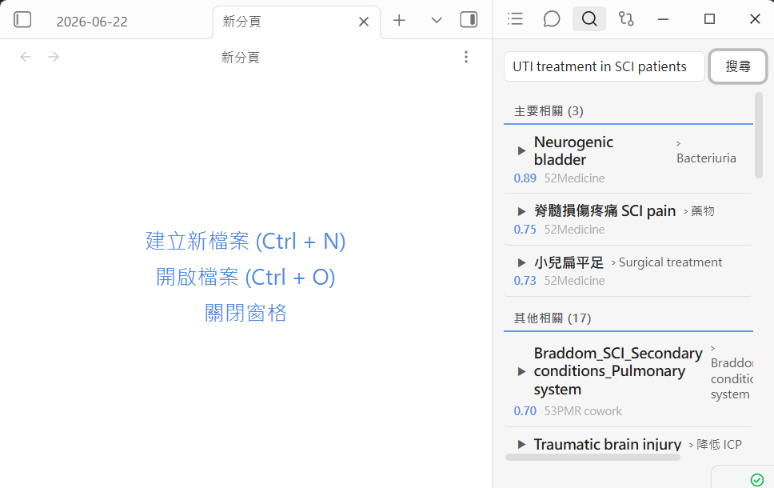
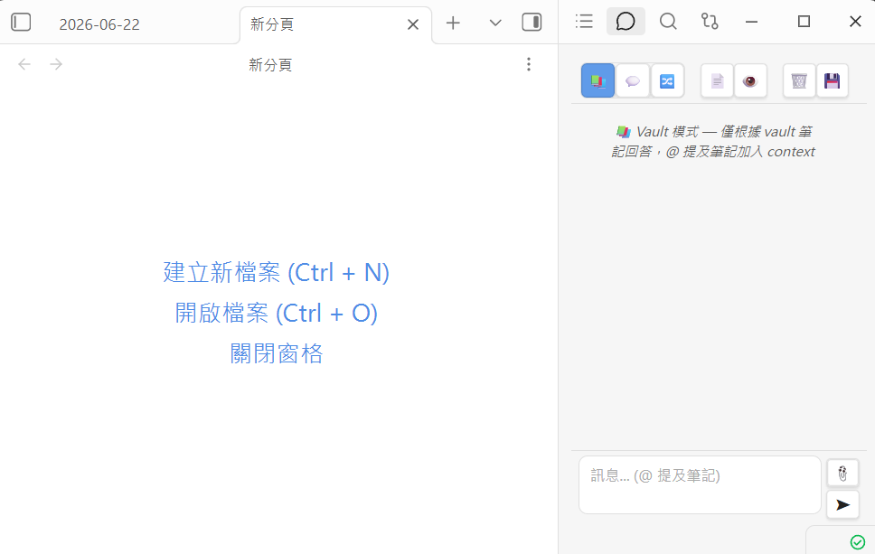
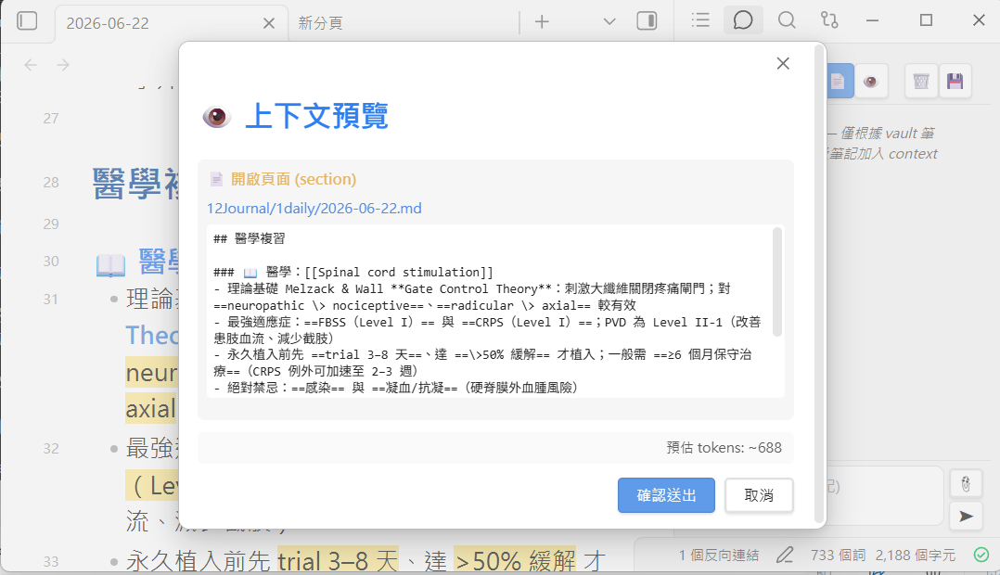

# Obsidian Vault Search — 地端優先的語意搜尋三套組

> [English](./README.md) · **繁體中文**

三個工具，把你的 Obsidian vault 變成一個**可語意搜尋、可 AI 對話的知識庫**——而且完全跑在自己的電腦上。沒有雲端索引、搜尋時筆記不離開你的電腦、檢索不需要按次數付 API 費用。

作者是一位醫師，為了從上千則臨床筆記中讀書而打造，但它**與領域無關**：指向任何一個放滿 markdown 筆記的 vault（研究、法律、工程、個人 wiki）都能用。


### 兩種使用方式（共用同一份索引）

這個 repo 提供**兩個前端、共用同一份地端 LanceDB 索引 + 檢索核心**，兩個都用或擇一都行：

- **`vault-search-obsidian`** — Obsidian plugin（側欄的 Search／Related Notes／Chat），連到一支小型地端 API server。→ [快速開始](#vault-search-obsidian--obsidian-plugin)
- **`vault-search-mcp`** — 一支 MCP server，把同一套搜尋以工具（`vault_search`、`vault_similar`、`vault_stats`、`textbook_search`）開給 Claude Code 或任何 MCP client。**不需要 Obsidian**。→ [快速開始](#vault-search-mcp--在-claude-code或任何-mcp-client中使用)

兩者共用同一份 `server/` 核心（indexer · scoring · Personalized PageRank · 知識圖譜），所以你只要索引一次，就能從任何地方查詢。

---

## 三套組

| 工具 | 功能 | 後端 |
|---|---|---|
| 🔍 **Vault Search** | 用自然語言（任何語言）輸入問題，回傳語意上最相關的筆記段落——不是關鍵字比對。 | LanceDB 向量搜尋 + 地端 embedding |
| 🔗 **Related Notes** | 即時側欄：當你閱讀或選取文字時，自動浮現你早已忘記寫過的相關筆記，串起 vault 裡的隱藏連結。 | 同一份索引的「找相似」模式 |
| 💬 **Vault Chat** | 跟你的筆記對話（RAG）。三種模式：**Vault**（只用筆記、100% 地端且免費）、**Hybrid**（筆記 + AI 知識）、**Free**（自由對話 + 文獻搜尋）。 | 地端 LLM 或你的 Claude 訂閱 |

三者都在 Obsidian 側欄。同一份索引還會開出一個 **MCP server**，讓 Claude Code 這類 coding agent 能把「搜尋你的 vault」當成一個工具來呼叫。

### 截圖

| 🔍 Vault Search | 🔗 Related Notes |
|---|---|
|  |  |

| 💬 Vault Chat | 👁 Context 預覽 |
|---|---|
|  |  |

---

## 為什麼做這個

Obsidian 內建搜尋是字面比對——它找你打的字。但你幾個月前寫的筆記，常常根本想不起當時用了哪些字。語意搜尋是用**意義**找筆記：搜尋 `脊髓損傷後的鬆弛性膀胱怎麼處理`，就算筆記裡沒出現這幾個字，也能找到你那則標題叫 `Neurogenic Bladder` 的筆記。

設計上的第一優先是**地端、隱私**：

- **embedding 在地端跑**，透過 [Ollama](https://ollama.com)（`bge-m3`，中英雙語、CPU 即可）。你的筆記內容不會被送到任何地方做索引或搜尋。
- **Vault 模式對話完全地端且免費**——地端 LLM 用檢索到的筆記回答，不計任何 token 費用。
- **Hybrid／Free 對話可選擇**呼叫 `claude` CLI，讓你直接用已經在付的 Claude 訂閱，而不必另外申請（並按 token 付費的）API key。

---

## 運作原理

```
                    ┌─────────────────────────────────────────┐
   Obsidian  ◄────► │  Plugin（側欄）：搜尋 · 相關 · 對話       │
                    └───────────────────┬─────────────────────┘
                                        │ HTTP (localhost:3789)
                                        ▼
                    ┌─────────────────────────────────────────┐
                    │  api_server.py  (FastAPI)                 │
                    │   /search  /similar  /chat  /reindex      │
                    └──────┬───────────────────────┬───────────┘
                           │                        │
                      embed query              RAG context
                           ▼                        ▼
        ┌────────────────────────┐     ┌──────────────────────────┐
        │ Ollama  (bge-m3)        │     │ Vault 模式 → 地端 LLM      │
        │ → 向量                  │     │ Hybrid/Free → `claude` CLI │
        └───────────┬────────────┘     └──────────────────────────┘
                    ▼
        ┌────────────────────────┐
        │ LanceDB 向量索引        │  ◄── indexer.py（依標題切塊、
        │ (~/.vault-search)      │       embed、儲存；增量更新）
        └────────────────────────┘

   同一份索引 + 排序也透過 mcp_server.py（MCP）提供給 coding agent。
```

- **`indexer.py`** 走訪你的 vault，把每則筆記依標題切成 chunk，用 `bge-m3` embedding，存進地端 **LanceDB** 表。再次執行是增量的（內容雜湊快取）。
- **`scoring.py`** 對原始向量結果重新排序，可選的**路徑加權**（讓你更信任某些資料夾）、**時近性**（新筆記排前面）、**關係**加權。
- **`ppr.py`** 用 **Personalized PageRank** 在 `[[wiki-link]]` 圖上排序筆記——HippoRAG / LinearRAG 風格的 random walk with restart。它驅動 **Related Notes** 與多跳的**查詢擴展**（以語意搜尋的 top 命中為種子做隨機遊走），找出純向量相似度漏掉的相關筆記。在作者的 vault 上，相較於樸素的 1-hop／共享連結擴展，sparse-bridge recall@10 從 ~60% 提升到 ~84%。
- **`api_server.py`** 服務 plugin：語意搜尋、找相似、單篇重新索引，以及對話（含檢索增強的 context）。
- **`mcp_server.py`** 把同一套搜尋以 MCP 工具開給 Claude Code 等：`vault_search`、`vault_similar`、`vault_stats`。
- **選用 add-on：** 第二份長文**參考語料**（`textbook_indexer.py`，parent-child 切塊）與 `[[wikilink]]` + 實體的**知識圖譜**（`graph_builder.py`）。

---

## 先備條件

| 需求 | 說明 |
|---|---|
| **Python 3.10+** | 跑 server 用。 |
| 本機執行 **[Ollama](https://ollama.com)** | 提供 embedding（以及選用的地端對話）。`bge-m3` 在 **CPU** 上就跑得動，GPU 只是加速大量索引。 |
| **Obsidian** | 用側欄 plugin。也可不開 plugin，純用 MCP/HTTP API headless 使用。 |
| **Claude CLI**（選用） | 只有 Hybrid／Free 對話需要。Vault 模式對話改用地端模型。 |
| 一台**常開的機器**（選用） | 若想讓手機或其他裝置也能搜尋／對話，就把 server 跑在常開的 PC／NAS 上。單機使用的話，開 Obsidian 時順手啟動即可。 |

先把 embedding 模型拉下來：

```bash
ollama pull bge-m3
# 選用，給零成本的地端 Vault 模式對話：
ollama pull gemma2:9b
```

---

## 安裝

### Step 0 — 共用核心（只做一次，兩個前端都需要）

```bash
git clone https://github.com/drpwchen/vault-search.git
cd vault-search
pip install -r requirements.txt

cp env.example .env          # 然後編輯 .env——把 VAULT_PATH 設成你的 vault 路徑

cd server
python indexer.py            # 建索引（之後執行為增量）
```

若還沒拉模型，先 `ollama pull bge-m3`（見[先備條件](#先備條件)）。接著從下面兩個前端擇一或都裝。

### `vault-search-obsidian` — Obsidian plugin

啟動地端 API server，再安裝 plugin：

```bash
python server/api_server.py                       # 服務於 http://localhost:3789
cp -r plugin "<你的VAULT>/.obsidian/plugins/vault-search-plugin"
```

在 Obsidian：**設定 → 第三方外掛 → 啟用「Vault Semantic Search」**。打開它的設定，確認 **API Server URL** 是 `http://localhost:3789`。側欄會出現三個圖示：🔍 搜尋、💬 對話、🔗 相關筆記。

> plugin 附了一份 `data.json.example`。Obsidian 會在首次執行時寫出真正的 `data.json`；千萬不要把含 API key 的 `data.json` commit 上去。

### `vault-search-mcp` — 在 Claude Code（或任何 MCP client）中使用

不需要 Obsidian、不需要 API server——直接拿 Step 0 建好的索引註冊 MCP server：

```bash
claude mcp add vault-search -- python "/abs/path/to/server/mcp_server.py"
```

之後 Claude Code（或任何 MCP client）就能呼叫 `vault_search`、`vault_similar`、`vault_stats`，以及（若你有索引參考語料）`textbook_search`，全部背後共用同一份地端索引、Personalized PageRank 擴展與重新排序。

---

## 設定

一切都由環境變數驅動（完整註解清單見 **`env.example`**）。唯一必填的是 `VAULT_PATH`。重點：

| 變數 | 預設 | 用途 |
|---|---|---|
| `VAULT_PATH` | —（必填） | vault 的絕對路徑。 |
| `VAULT_SEARCH_DATA_DIR` | `~/.vault-search` | 索引／快取／log 存放處。 |
| `OLLAMA_HOST` | `http://localhost:11434` | Ollama 端點。 |
| `VAULT_SEARCH_EMBEDDING_MODEL` | `bge-m3` | vault embedding 模型。 |
| `VAULT_SEARCH_API_PORT` | `3789` | API server 連接埠。 |
| `CLAUDE_CMD` | `claude` | Hybrid／Free 對話用的 CLI。 |
| `VAULT_SEARCH_CHAT_MODEL` | `gemma2:9b` | Vault 模式對話的地端模型。 |
| `VAULT_SEARCH_PERSONA` / `_LANGUAGE` | 通用 | 自訂助理角色與回答語言。 |
| `VAULT_SEARCH_PATH_WEIGHTS` | `{}` | 在排序中加權／降權資料夾。 |
| `VAULT_SEARCH_EXCLUDE_PATTERNS` | （無） | 預設把衍生筆記（草稿、暫存）排除在搜尋外。 |

---

## 選用 add-on

<details>
<summary><b>第二份參考語料（教科書／手冊）</b></summary>

如果你把一大批長文參考資料（轉檔的 PDF、手冊）與筆記分開存放，可用 parent-child 切塊索引，做到命中精準又帶上下文：

```bash
export VAULT_SEARCH_TEXTBOOK_PATH=/path/to/reference-md
ollama pull qwen3-embedding:0.6b
cd server && python textbook_indexer.py
```

會新增 `textbook_search` 工具（MCP + HTTP）。可用 boost 檔讓你信任的來源排前面——見 `examples/source_boost.example.json` 與 `VAULT_SEARCH_SOURCE_BOOST`。
</details>

<details>
<summary><b>知識圖譜（wikilink + 實體）</b></summary>

```bash
cd server
python graph_builder.py            # 解析 [[wikilink]] 成鄰接圖
python graph_builder.py --ner      # 選用：scispaCy/NER 實體抽取
```

存在時，wiki-link 圖會驅動 `ppr.py` 的 **Personalized PageRank** 檢索（Related Notes + 查詢擴展），搜尋結果也會被連結筆記與抽出的關係加以擴充。NER 步驟需要 `scispacy`（見 `requirements.txt`）。PPR 本身是純 Python，只需要 wiki-link 圖（Phase A），不需要 NER。
</details>

---

## 依你的環境調整（替代方案）

這專案是繞著**一台常開、有 GPU 的 PC + Claude 訂閱**打造的，但這些都不是必要。對照下表挑你的情況：

| 你沒有… | 改這樣做 |
|---|---|
| **GPU** | 不用做什麼——`bge-m3` 在 CPU 上就能 embed。超大 vault 的索引會慢些，但搜尋是即時的。想更輕量可用更小的模型（`nomic-embed-text`），設好 `VAULT_SEARCH_EMBEDDING_MODEL`（與 `_DIM`）再重建索引即可。 |
| **Claude 訂閱** | 對話改用 **Vault 模式**——完全跑在地端 Ollama 模型（`VAULT_SEARCH_CHAT_MODEL`），零成本。把 `CLAUDE_CMD=` 留空即可停用 Claude 後端模式。 |
| **常開的機器** | 開 Obsidian 時再啟動 `api_server.py` 就好（或包成登入啟動項／`systemd --user`／工作排程器）。搜尋只在你使用時需要 server。 |
| **第二台裝置要連** | 把 server 跑在家裡的 PC 或 NAS，把 plugin 的 **API Server URL** 指到那台主機，並設一組 **API key**（server 端 `VAULT_API_KEY` 環境變數 + plugin 設定填同一把 key），確保只有你能查詢。 |
| **完全不想跑 server** | 只用 **MCP server** 搭配終端機的 Claude Code——不用 FastAPI 程序、不用 plugin。 |

想用雲端 embedder 取代 Ollama？embedding 呼叫集中在 `indexer.py` / `api_server.py` 的 `client.embed(...)`；換成任何供應商、保留同一套 LanceDB 流程即可。

---

## 安全須知

- API server 支援 **API key**（`X-API-Key`）。在 server 端設 `VAULT_API_KEY`（環境變數）或 `~/.vault-search/api_key.txt`，並在 plugin 設定填入同一把 key。只要 server 不只在 `localhost` 可達，**務必**設一組。
- `.env`、`plugin/data.json`、整個 `~/.vault-search/` 資料夾都已被 git 忽略。切勿 commit 任何密鑰或索引。
- Hybrid／Free 對話以子程序呼叫 `claude` CLI，並帶**工具拒絕清單**（不能寫檔、不能執行 shell）——它只能讀你傳入的 context，並呼叫唯讀的文獻工具。

---

## 專案結構

```
server/      indexer · scoring · ppr · api_server · mcp_server   （核心三套組）
             textbook_indexer · graph_builder              （選用 add-on）
             config.py                                      （所有設定，環境變數驅動）
plugin/      main.js · manifest.json · styles.css           （Obsidian plugin）
examples/    source_boost.example.json
docs/images/ 截圖
env.example  複製成 .env
```

## 作者

由 **陳醫師（Dr. P.W. Chen）** 打造——一個只是想在自己幾千則筆記裡找得到東西的復健科醫師。
🌐 [drpwchen.com](https://drpwchen.com) · 🐙 [github.com/drpwchen](https://github.com/drpwchen)

## 授權

MIT — 見 [LICENSE](./LICENSE)。歡迎 PR 與 issue。

## 🧋 支持

如果這個工具幫你省下時間，歡迎請我喝杯珍奶，讓伺服器繼續轉下去 🧡

[](https://drpwchen.bobaboba.me)
